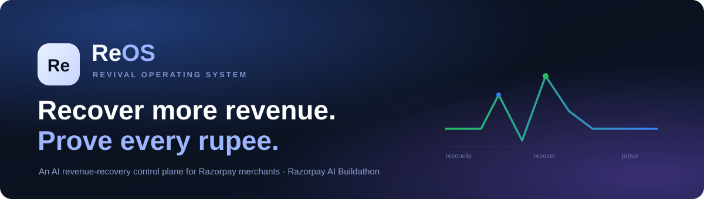
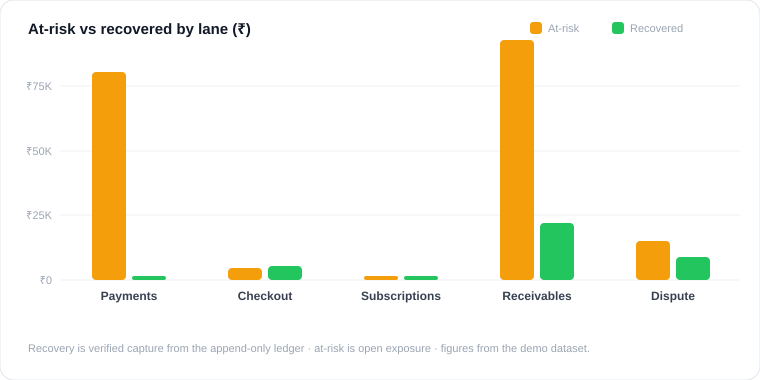
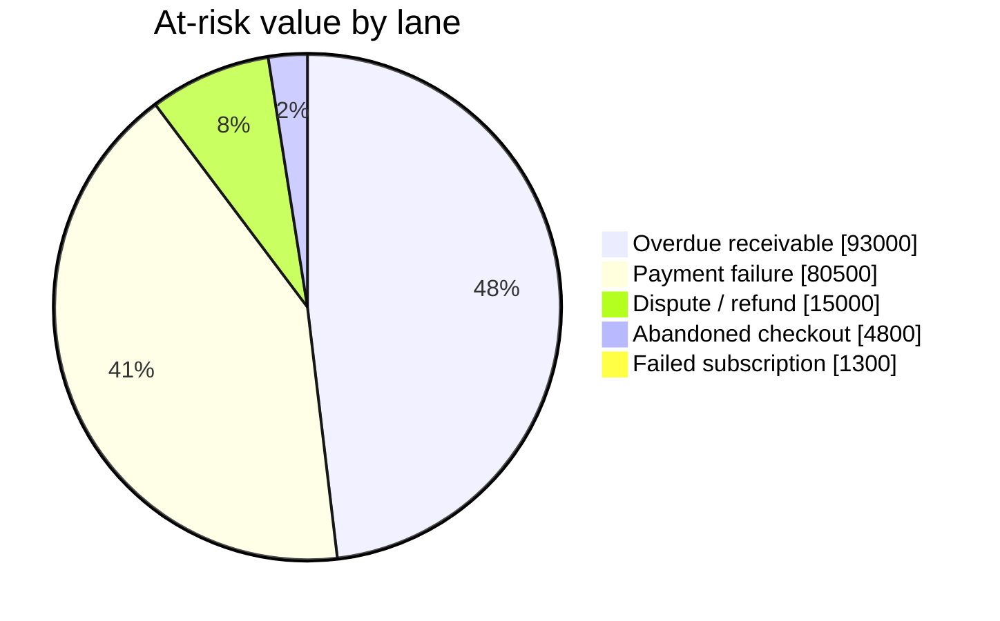
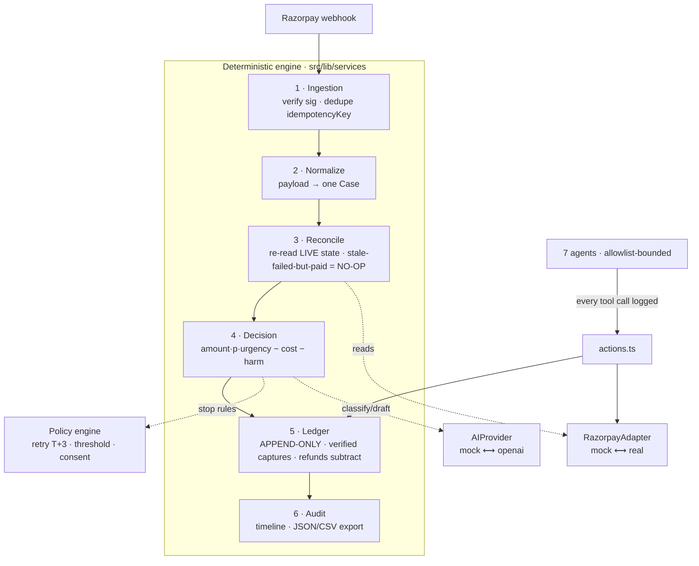
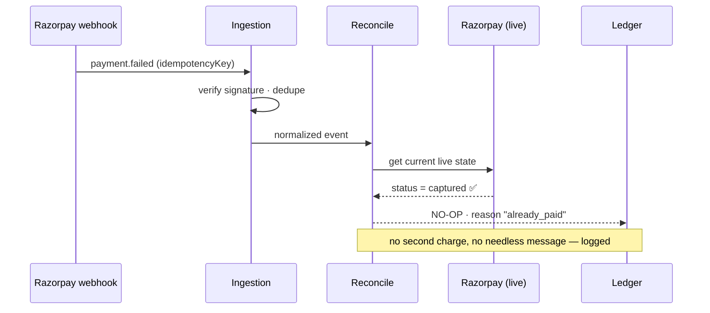
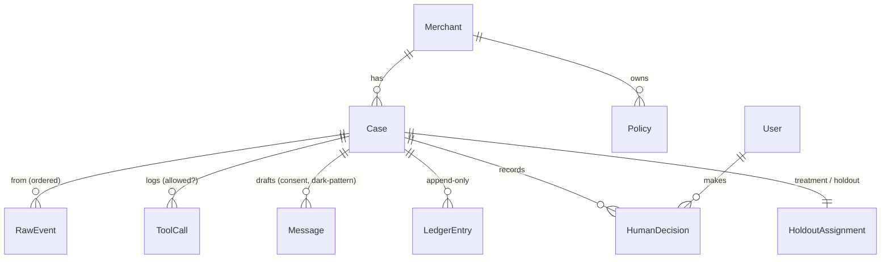

<p align="center">
  
</p>

<h1 align="center">ReOS · Revival Operating System</h1>

<p align="center">
  <b>An AI revenue-recovery control plane for Razorpay merchants.</b><br/>
  Built for the <b>Razorpay AI Buildathon</b> · Track 03 — AI Revenue Recovery.
</p>

<p align="center">
  
  
  
  
  
  
  
</p>

---

## The thesis

> **Given a _verified_ revenue-risk event, recover the most money with the least
> customer friction — and prove exactly what happened, why, and when we chose to stop.**

A merchant on Razorpay loses revenue across four surfaces: **payment failures,
abandoned checkouts, failed subscriptions, and overdue receivables.** ReOS detects
each at-risk event, **reconciles it against live state**, chooses **one** bounded
intervention inside a **policy the merchant owns**, and **proves the exact money
recovered** — subtracting refunds and disputes back out.

It is a **desktop operations console** (Linear / Stripe Dashboard feel), not a
chatbot — with role-based logins, an append-only money ledger, a visible safety
cockpit, and **Baymax**, an in-app AI companion (Google Gemini, with an offline
fallback so it always works).

> **Who benefits (kept honest):** the **merchant** gets the recovered revenue,
> eliminated double-charge risk, and a full audit trail. **Razorpay's** benefit is a
> stated _hypothesis_ (stickier platform via conversion + retention) and is measured
> **separately** — never conflated with merchant recovery.

---

## What it looks like

<p align="center"></p>

**Where the risk sits — at-risk value by lane (₹, live demo dataset):**



Ten screens, all rendering real data with working controls:

| Screen | What it does |
|---|---|
| **Overview** | KPI heroes (hover → mini-graph, double-click → open), recovery trend, lane donut, top opportunities, agent activity |
| **Cases** | Dense sortable/filterable grid, detail drawer, bulk actions |
| **Case decision log** | Event → reconcile → classify → action → outcome, with an operator action panel |
| **Approvals** | Prepared-but-unsent actions with drafted-message previews; auto-approve config |
| **Guardrails** | **"What the agent refused to do"** — blocked tools, dark-pattern rejections, consent/budget stops |
| **Ledger** | Append-only money record + running totals + simulate-refund (net auto-corrects) + CSV |
| **Policies** | Versioned rules (retry budget, thresholds, consent); saving creates a new version |
| **Agents** | 7 roles (3 AI / 3 deterministic) with editable tool allowlists + recent decisions |
| **Replay** | Streams six scripted moments through the real pipeline; treatment-vs-holdout toggle |
| **Metrics** | All ten measures as charts + a one-click audit export (JSON + CSV) |
| **Settings / Profile** | Workspace, team, **Connect Gemini**, editable profile (photo + impact stats) |

---

## Architecture — a deterministic engine, a bounded AI layer

**Money truth is deterministic.** The LLM only classifies, prioritises, drafts, and
explains. **Money changes state in exactly one place: `ledger.append()`.**



### The double-charge firewall (reconcile → no-op)



### Data model (Prisma · SQLite)



---

## The 5-minute demo — Replay & Experiment Studio (`/replay`)

Press **Run Replay** and watch six scripted moments stream through the _same_ services production uses:

| # | Moment | Outcome |
|---|---|---|
| 1 | Stale `payment.failed` on a now-captured order | **NO-OP** (already_paid) — no double charge |
| 2 | Duplicate + out-of-order events | **Blocked** — deduped, ordered by `orderIndex` |
| 3 | Consented abandoned cart | **Recovered** — attributed only after a verified capture |
| 4 | Subscription failed all 3 daily retries (T+3) | **Stopped** — halted at the retry budget |
| 5 | High-value overdue receivable above threshold | **Escalated** — routed to a human |
| 6 | A recovered payment is refunded | **Refunded** — ledger auto-subtracts from net |

A **treatment-vs-holdout toggle** recomputes _incremental_ recovery live.
`npm run demo` prints the three headline numbers from the same pipeline:

```
Gross recovered:        ₹11,998
Incremental recovered:  ₹35,722   (vs matched holdout)
Net recovered:          ₹2,999    (after ₹8,999 refunds)
```

---

## Roles — role-based logins & dashboards

| Role | Sees | Can do |
|---|---|---|
| **Admin** (Ajay John Paul) | Everything + Settings | Full control, policies, agents, team, Connect Gemini |
| **Recovery Operator** | Cases, Approvals, Guardrails, Agents, Replay | Approve / escalate / hold cases |
| **Finance Analyst** | Overview, Cases, Ledger, Metrics, Replay | Ledger tools + exports (read-only on cases) |
| **Auditor** | Read-only oversight | View everything, change nothing |

Every screen and every action adapts to the signed-in role (enforced in middleware **and** on the API).

---

## Quickstart

```bash
npm install
npm run seed      # migrates + seeds a merchant, 4 role users, 15 cases across 5 lanes
npm run dev       # http://localhost:3000
```

Runs **fully offline with zero external keys** (mock AI + mock Razorpay). Then sign in:

| Account | Password | Role |
|---|---|---|
| `Ajay John Paul` | `12345619` | Admin |
| `Aarav Mehta` | `operator123` | Recovery Operator |
| `Sara Iyer` | `analyst123` | Finance Analyst |
| `Devan Rao` | `auditor123` | Auditor |

**Optional — connect Baymax to Gemini:** Settings → Connect Gemini → paste a key from
[Google AI Studio](https://aistudio.google.com/app/apikey) → **Test connection**.

Other scripts:

```bash
npm run test      # Vitest — the credibility core (reconcile, dedupe, ledger, policy, metrics…)
npm run demo      # runs the pipeline from the CLI and prints gross / incremental / net
npm run build     # production build
npm run db:reset  # reset + reseed a pristine baseline
```

---

## Tech stack

Next.js 16 (App Router) · TypeScript (strict) · Tailwind v4 + shadcn/ui (Base UI) ·
TanStack Table v8 · Recharts · React Query + Zustand · Zod · Prisma + SQLite ·
`motion` (animations) · bcrypt + signed-cookie auth · Vitest.

- **AI seam** — `src/lib/ai` (`MockProvider` default, OpenAI driver) + **Baymax** on Google Gemini.
- **Payments seam** — `src/lib/razorpay` (`MockRazorpay` default; the mock can return a
  live state that _contradicts_ a webhook — that is what makes reconciliation real).

---

## Project structure

```
prisma/
  schema.prisma            12 models; LedgerEntry is APPEND-ONLY
  seed.ts                  merchant, 4 role users (bcrypt), 15 cases across 5 lanes
  fixtures/                live entity states (with contradictions) + webhook stream
  migrations/              versioned SQL migrations
src/
  proxy.ts                 auth + role gating (Next 16 "middleware")
  lib/
    db.ts env.ts types.ts format.ts   singleton client · zod env · domain types · formatters
    api.ts api-types.ts hooks.ts       route helpers · client types · React Query hooks
    assistant.ts                       Baymax — Gemini + offline knowledge base
    auth/                              session (HMAC) · roles/perms · server + client context
    ai/                                AIProvider: provider · mock · openai · index
    razorpay/                          RazorpayAdapter: adapter · mock · real · verifySignature
    policy/engine.ts                   eligibility + stop rules (pure, unit-tested)
    services/                          ingestion · normalizer · reconcile · decision · ledger ·
                                       audit · metrics · replay · caseActions · caseQueries · policyStore
    agents/                            orchestrator + classifier/communicator/receivablesReader (AI)
                                       + prioritiser/retryStrategist/escalationBuilder (code)
                                       + darkPatternScreen · registry · prompts
  app/
    login/                             branded split-screen login
    (dashboard)/                       10 screens (overview, cases[/id], approvals, guardrails,
                                       ledger, policies, agents, replay, metrics, settings, profile)
    api/                               Zod-validated route handlers (auth, cases, actions,
                                       approvals, guardrails, ledger, policies, agents, replay,
                                       metrics, export, webhook, assistant, settings, profile)
  components/                          brand · shell · kpi · charts · assistant (Baymax) · ui · ui-ext
  tests/                               engine + adapters + DB integration tests
scripts/demo-replay.ts                 CLI: prints gross / incremental / net
docs/
  architecture.md agents.md metrics.md the six layers · the 7 agents · every formula
  engineering-guidelines.md            module map + coding standards
  BUILD_BRIEF.md                       the original brief this was built from (reference)
  assets/                              README diagrams & charts (SVG)
references/                            source research PDFs + build-brief materials
CONTRIBUTING.md                        standards & getting started
```

---

## How this was built — the brief

This project was built end-to-end from a detailed, phased brief. That original brief —
the step-by-step build plan and the laws it had to follow — is captured in
**[`docs/BUILD_BRIEF.md`](docs/BUILD_BRIEF.md)**, with the source research in
**[`references/`](references)**. Deeper docs:

- [`docs/architecture.md`](docs/architecture.md) — the six layers + diagram
- [`docs/agents.md`](docs/agents.md) — the seven agents (AI vs deterministic)
- [`docs/metrics.md`](docs/metrics.md) — every metric formula

---

## Safety, in one line

No AI code path moves money. Money moves **only** through `ledger.append()`, and every
recovered rupee traces to a capture confirmed by **re-reading live state**. Manipulative
messages are refused, un-consented sends are blocked, and every refusal is logged and
shown on **Guardrails**.

---

<p align="center">
  <sub>Created by <b>Ajay John Paul</b> for the Razorpay AI Buildathon · ReOS — Revival Operating System</sub>
</p>
