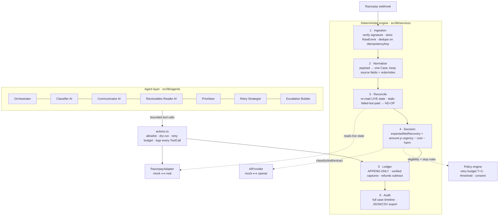

# Architecture

RevivalOS is a deterministic engine with a thin, bounded AI layer on top. **Money
truth is deterministic** — the LLM only classifies, prioritises, drafts, extracts,
and explains. Money changes state in exactly one place: `ledger.append()`.

## The six layers

### 1 · Ingestion (`ingestion.ts`)

Verifies the webhook signature (HMAC-SHA256 with `RAZORPAY_WEBHOOK_SECRET`; mock
mode accepts fixtures), stores the `RawEvent`, and **dedupes on `idempotencyKey`**
so a duplicate delivery never creates a second case or a second charge. The DB
`@unique(idempotencyKey)` is the guarantee; a concurrent race is caught (`P2002`)
and treated as a duplicate.

### 2 · Normalize (`normalizer.ts`)

Maps a Razorpay-shaped payload (payment / order / subscription / invoice / dispute
/ refund) into one normalized event, keeping the source status, amount, and
`orderIndex`.

### 3 · Reconcile (`reconcile.ts`) — the double-charge firewall

A webhook is a point-in-time snapshot. Razorpay can send `payment.failed` then
`payment.captured` for the same transaction. So **before proposing any action we
re-read the current live state** via the adapter. If the entity is already settled
while the webhook said it failed → **NO-OP** with `reasonCode: "already_paid"`.

### 4 · Decision (`decision.ts`)

`expectedNetRecovery = amount × probability × urgency − expectedCost − harmRisk`.
Probability is rule-based (base rate per failure class, eroded by attempts) with a
documented hook to learn it from outcomes. Emits a `reasonCode`, `confidence`,
proposed action, approval state, and the `policyVersion` it decided under. Consent
and dark-pattern risk are priced so a message never wins without consent.

### 5 · Ledger (`ledger.ts`) — the only money mutation

`append()` creates immutable rows; nothing updates or deletes. A refund/dispute is
a **negative** entry that auto-corrects `net`. `computeTotals()` derives
`{ gross, refunds, net }` from the log — so a refund can never leave a recovery
overstated. A recovery is only recorded **after re-reading a verified capture**.

### 6 · Audit (`audit.ts`)

Assembles the full ordered case timeline (event → tool calls → messages → decisions
→ ledger) and produces JSON/CSV exports. `auditCompleteness` measures how many cases
carry a complete trail.

## Supporting pieces

- **Policy engine** (`src/lib/policy/engine.ts`) — pure eligibility + stop rules:
  retry budget (T+3 = 3), amount threshold, due-age, consent, channel allowlist,
  auto-approve classes.
- **Adapters** (`src/lib/{ai,razorpay}`) — interface + mock (default) + real, chosen
  from env. `MockRazorpay` can return a live state that **contradicts** a webhook.
- **Agents** (`src/lib/agents`) — 1 orchestrator + 3 AI + 3 deterministic; every
  agent has one job, a fixed tool allowlist, and an abstention rule. All tool calls
  go through the bounded action layer (`actions.ts`).

## App

Next.js App Router. `src/app/(dashboard)` holds nine screens; `src/app/api` holds
the Zod-validated route handlers that reuse the services. React Query drives the
client; mutations invalidate and refetch.
